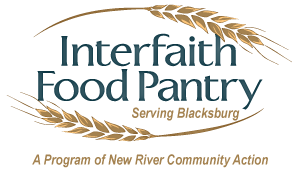

  

In this project we developed an application for the Aurora food pantry as to simulate working on a project in a 4 man team for a client.  Project requirements were given to us via interaction witht he client (professor) and client meeting and requirements gathering was also simulated.  This was a great learning experience for me as I got experience of version control using Github, experience developing a Java Application, experience meeting client deadlines, as well as colaborating in a team enviorment.  

Source: <a href="https://github.com/bjaynes01/Advanced-Programming-V2">InterFaith Food Pantry: Volunteer Hour Tracking App</a>

